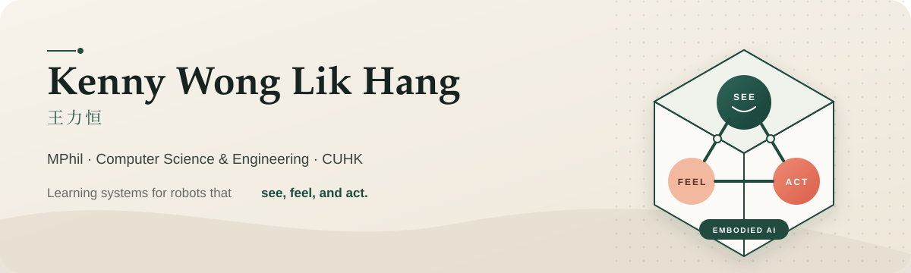
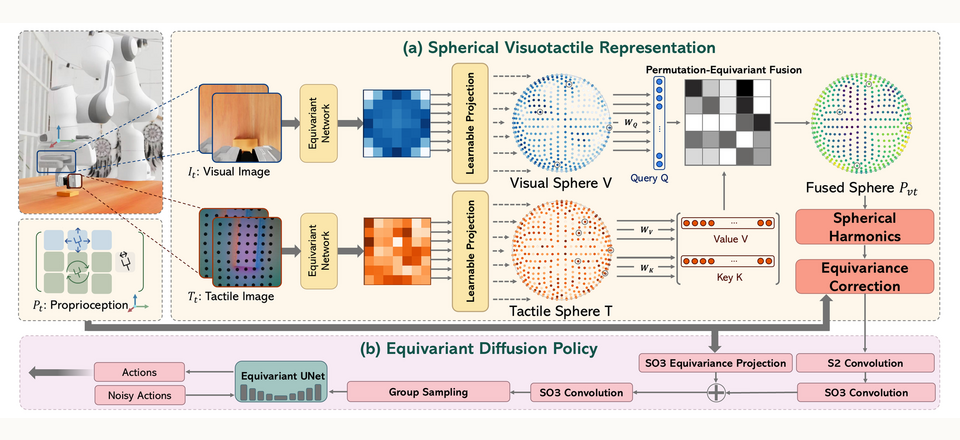
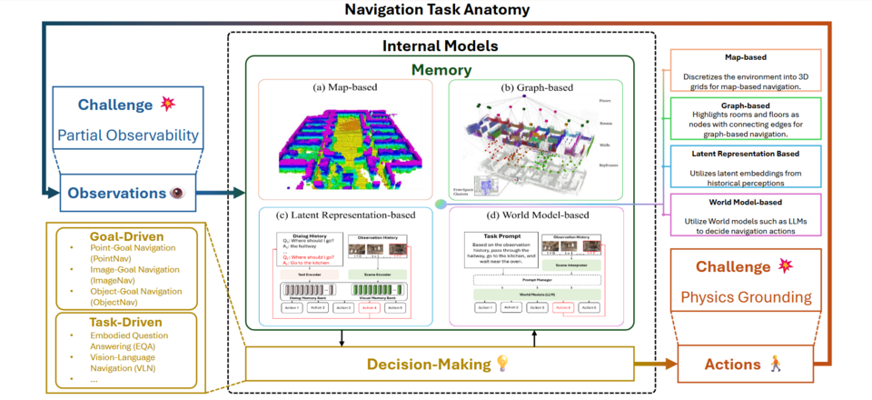

  

  <a href="https://kenn3o3.github.io/"><strong>Website</strong></a>
  &nbsp;·&nbsp;
  <a href="https://scholar.google.com/citations?user=x0JaFVIAAAAJ">Google Scholar</a>
  &nbsp;·&nbsp;
  <a href="https://orcid.org/0009-0004-3599-1649">ORCID</a>
  &nbsp;·&nbsp;
  <a href="https://www.linkedin.com/in/kennywlh">LinkedIn</a>
  &nbsp;·&nbsp;
  <a href="https://kenn3o3.github.io/files/resume.pdf">CV</a>
  &nbsp;·&nbsp;
  <a href="mailto:klhwong3@outlook.com">Email</a>

I am an MPhil student in Computer Science and Engineering at [The Chinese University of Hong Kong](https://www.cuhk.edu.hk/), advised by [Prof. Qi Dou](https://www.cse.cuhk.edu.hk/~qdou/). My research sits at the intersection of **embodied AI**, **visuotactile perception**, and **robot learning**—with a focus on helping robots reason through contact and manipulate the physical world reliably.

  <code>Visuotactile Learning</code>&nbsp;&nbsp;
  <code>Contact-rich Manipulation</code>&nbsp;&nbsp;
  <code>Diffusion / Flow Policies</code>&nbsp;&nbsp;
  <code>3D Vision</code>

## Selected research

<table>
  <tr>
    <td width="50%" valign="top">
      
      <h3>VISTA</h3>
      
<strong>CoRL 2026</strong> · Equivariant Visual-Tactile Diffusion Policy for Contact-Rich Manipulation

      
Fuses visual and tactile observations on the sphere to learn spatially robust manipulation policies.

      
<a href="https://vista-paper.github.io/">Project</a> · <a href="https://github.com/Kenn3o3/Vista">Code</a> · <a href="https://kenn3o3.github.io/projects/vista">Overview</a>

    </td>
    <td width="50%" valign="top">
      
      <h3>Physics Simulators for Embodied AI</h3>
      
<strong>ACM Computing Surveys</strong>

      
A structured survey of simulation platforms for robotic navigation and manipulation.

      
<a href="https://arxiv.org/abs/2505.01458">Paper</a> · <a href="https://kenn3o3.github.io/projects/eai-survey">Overview</a>

    </td>
  </tr>
</table>

## A little more about me

- 🎓 **CUHK** — MPhil in Computer Science & Engineering; MSc in Computer Science, Dean's List
- 🏅 **CityUHK** — BSc in Computer Science, *cum laude* and top 15% of the graduating class
- 🧭 Previously explored legged-robot navigation at **Oak Ridge National Laboratory / UTK**
- 🏀 Outside the lab: basketball, golf, swimming, hiking, music, gaming, and exploring new places

 

  <em>Always happy to talk about robots that learn from sight, touch, and interaction.</em>  
  <a href="mailto:klhwong3@outlook.com"><strong>Get in touch →</strong></a>

